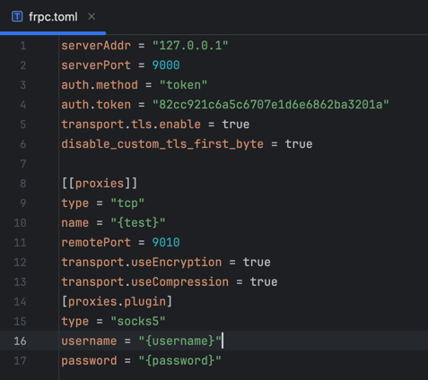
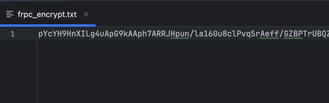
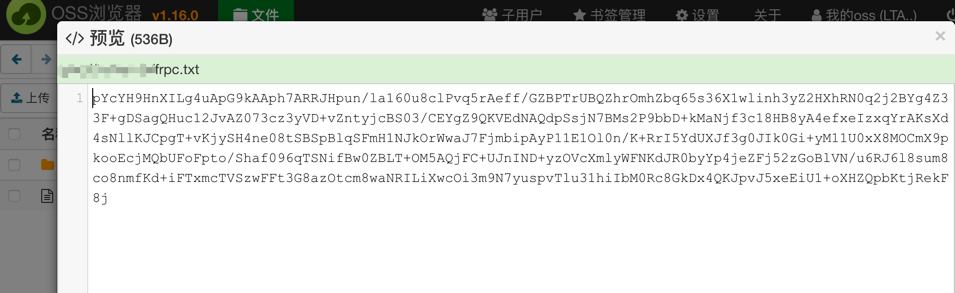
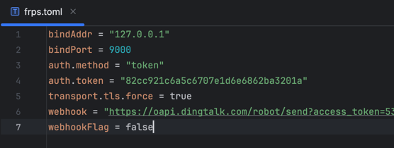
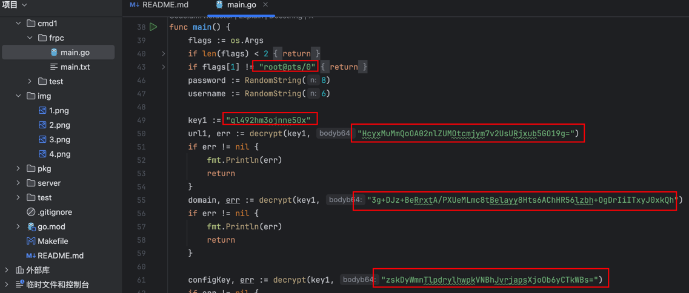
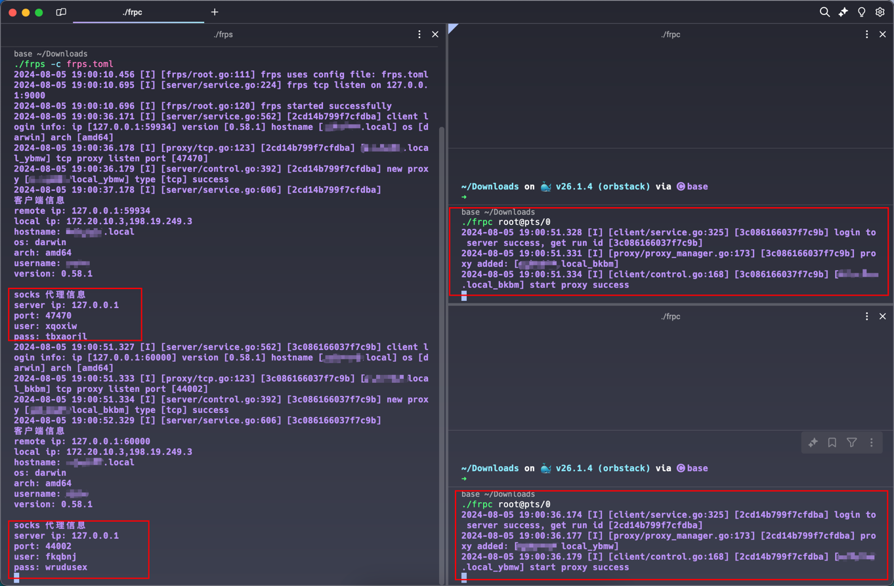
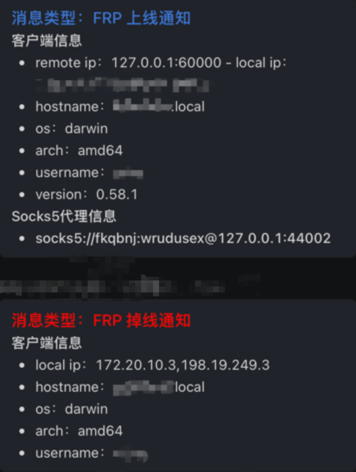
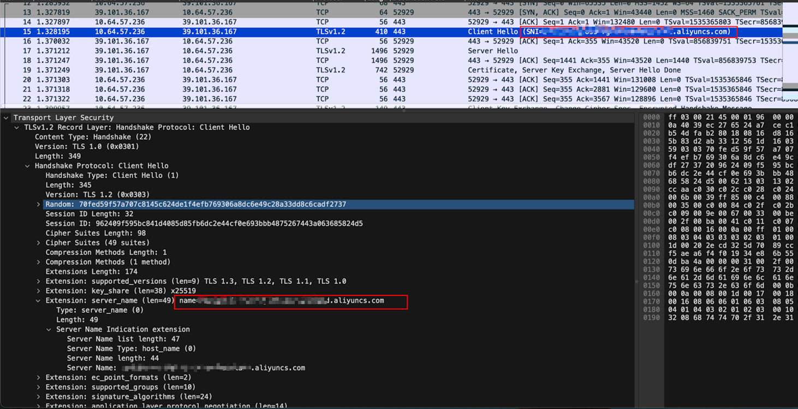
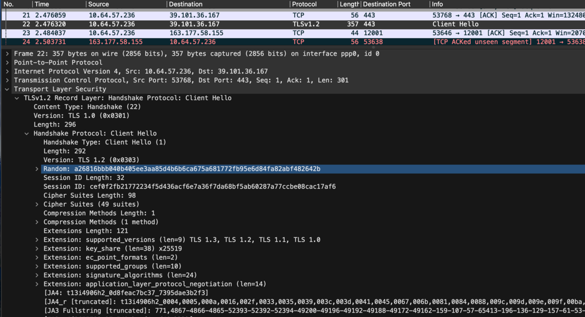

# 团队介绍
> **重庆九宫格安全团队**致力于分享开源安全工具、研究方向覆盖红蓝对抗、Web安全、移动安全、安全开发、企业安全建设、物联网/工控安全/AI/量子安全等多个领域，对安全感兴趣的小伙伴可以关注我们。


# frp-0.58.1魔改功能介绍

## 功能介绍
- 默认配置tls加密传输,默认模板为socks5隧道
- 随机生成socks5账户和密码
- frpc去掉-h帮助，执行无输出，需要指定参数运行
- frps钉钉通知上线，输出信息
- frps钉钉掉线通知
- 去掉frpc静态web资源、删除不必要的模块、替换frpc默认包名、替换frp关键字，编译器进行混淆编译(静态免杀)
- 关闭tls 0x17流量特征(frp新版自带功能)
- socks5隧道时，remotePort端口在frps端指定的端口范围内随机选择（默认40000-50000端口）、随机插件name值(hostname+随机字符串)
> 执行./frpc后，remotePort端口将在指定的端口范围内随机选择一个端口，若端口被占用，将自动重新随机选择，直到选择到没有被占用的端口

> 好处是：**一次编译，到处运行**。不用每次重新编辑frpc.toml指定remotePort和name值；方便在攻防比赛中，多台服务器上线

- frpc客户端运行时从oss读取AES加密后的frpc配置内容，且通过域前置方式读取，无法抓包得到oss域名
> 攻防演练结束后直接删除oss配置文件，无留痕

- 再次加密frpc关键信息(oss域名、ossIP、frpc解密密钥等)，防止静态分析出关键信息

## 保姆级-食用指南
> 安装并配置go、make(可省略)环境

### 一、开通OSS存储桶
> 权限设置为oss公共可读

### 加密frpc配置内容上传到oss

> 根据自己电脑操作系统类型，查看**Makefile**文件，编译**frps**，若没有相应的操作系统请自行增加

> 以mac arm架构为例， 执行 `make frps-darwin` 将在bin目录下生成frps

配置**bin/frpc.toml**内容，默认只需更改serverAddr、serverPort和token值即可



> 运行 **frps encrypt** 命令 加密frpc配置文件frpc.toml，生成配置加密文件：frpc_encrypt.txt

-d：你注册的oss域名地址

-u：oss域名对应的 IP 地址（阿里云官方服务器）

/frpc.txt: oss存储对应位置文件

```shell
./frps encrypt --frpcFile frpc.toml -d xxxxoss.aliyuncs.com -u https://阿里云ossIP地址/frpc.txt
```

将会在同级目录下生成frpc_encrypt.txt文件：


将加密后的文本上传到oss上，注意权限公共可读



### 配置frps.toml
> 配置frps.toml，其中webhook为钉钉webhook通知；
> webhookFlag为true时，将开启钉钉通知




### 编译frpc客户端
> 执行./frps encrypt命令时，已自动把相关frpc配置加密信息填充到frpc模板中，其中`root@pts/0`为启动命令参数，可自行修改



> 这里只需要执行相应客户端编译命令即可, 请查看Makefile文件内容

> 执行 `make frpc-darwin`命令，将在bin目录生成frpc客户端

> 若需要混淆编译，请使用`garble`进行编译

### 运行效果图

可多次执行frpc客户端，钉钉通知随机生成的socks5账户密码及端口





### oss域前置抓包效果
如果直接填写oss域名， https抓包将会在SNI显示oss域名



如果通过配置 host访问，将无法得到oss域名，还有一个好处是服务器若没配置dns，直接写oss域名将无法解析



## 